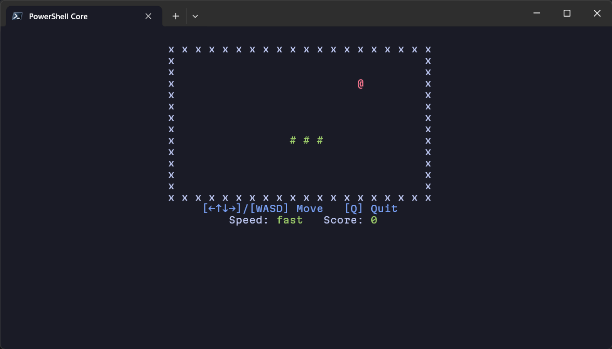

# Snake

Terminal snake game for Node.js.
Built with Typescript, [Ink](https://github.com/vadimdemedes/ink) and [React](https://github.com/facebook/react).



## Features

- Navigate with arrow keys and WASD.
- 3 levels of speed.
- Customizable game width and height.

## Requirements

- Node 18 or above.
- NPM / PNPM / Yarn

## Getting Started

Use NPM (or package manager of your choice) to download the game as a global package on your system:

```sh
npm i @edisoncks/snake -g
```

Now to start it, just type in the console:

```sh
snake
```

For customization options, run the game with `--help` parameter.

```sh
snake --help
```


